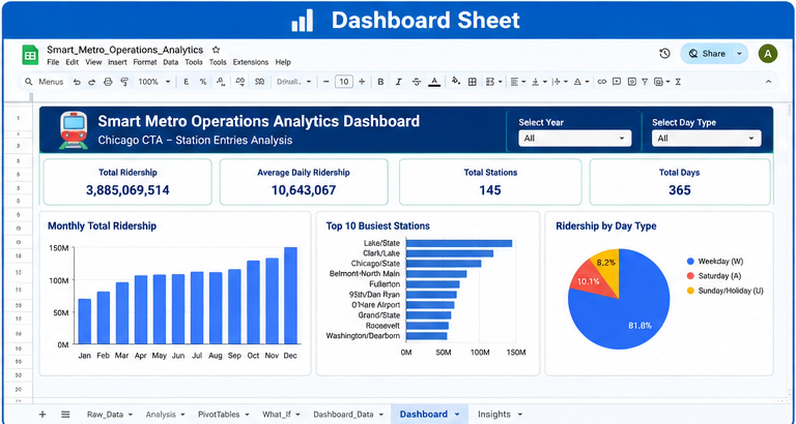
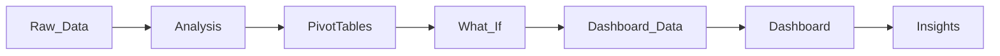
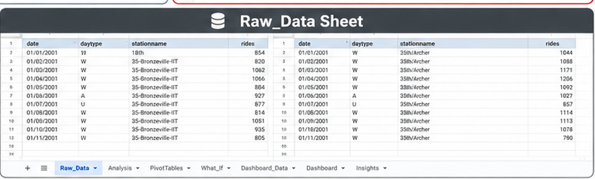
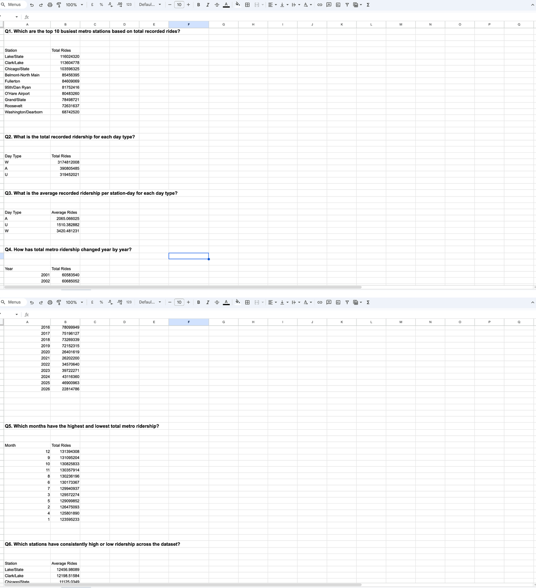
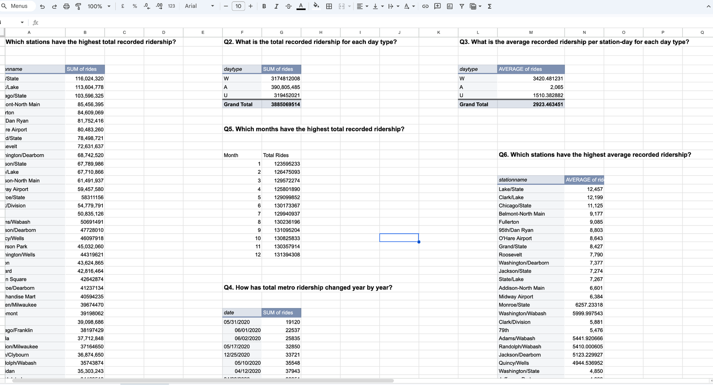
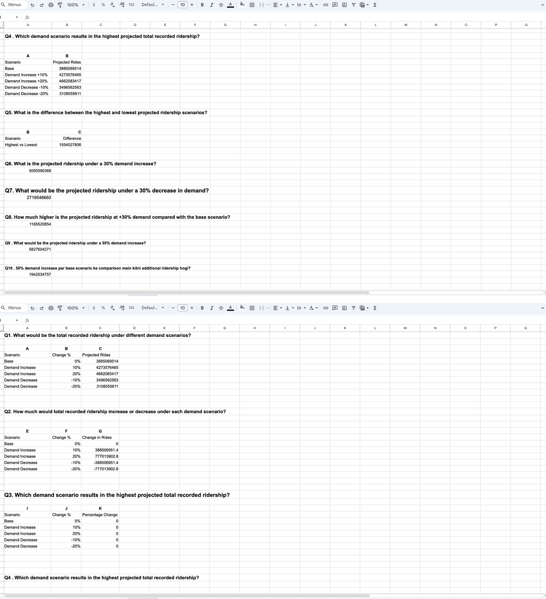
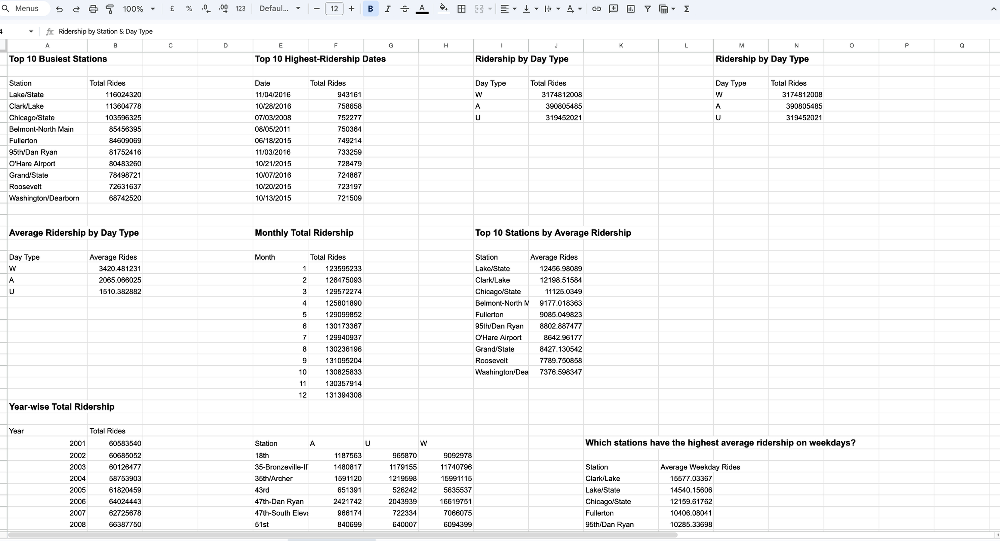
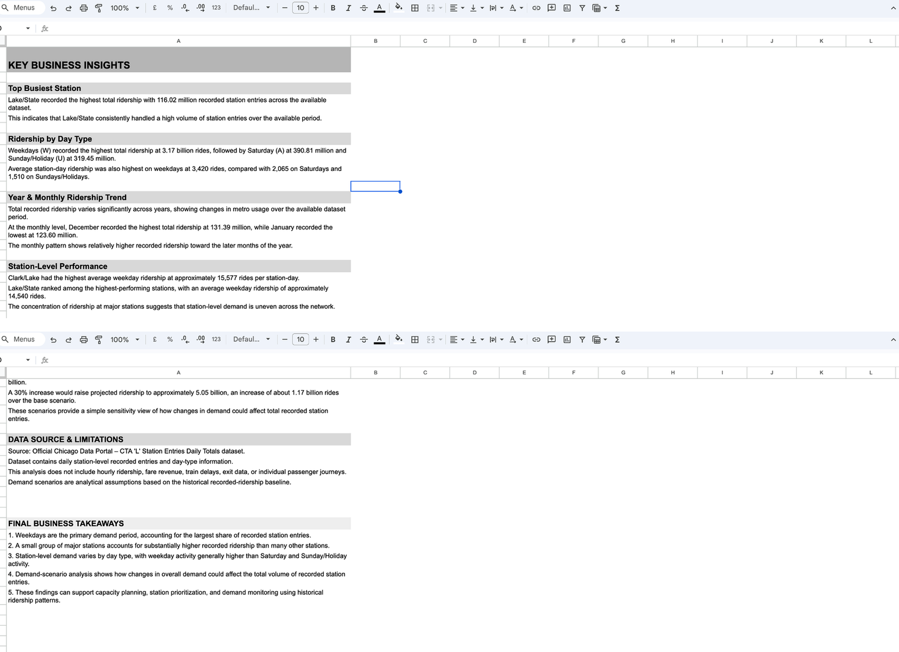

# 🚇 Smart Metro Operations & Crowd Analytics

**Beginner-level Data Analytics project on historical Chicago CTA 'L' station ridership**

 

---

## 📌 Project Objective

Analyze historical metro station ridership data to identify:

- 🏙️ Busiest metro stations
- 📅 Ridership by day type
- 📈 Year-wise and month-wise ridership trends
- 🚉 Station-level performance
- 🗓️ Weekday demand patterns
- 🔥 High-ridership dates
- 🎛️ Demand changes under different scenarios

---

## 🗂️ Dataset

**Source:** Official Chicago Data Portal — CTA 'L' Station Entries Daily Totals
**Live Workbook:** [Open the full Google Sheets project →](https://docs.google.com/spreadsheets/d/1RLCCozK9z_OW4k69DqeB9JApvmHiHhak_RATaPKblkk/edit?usp=sharing)

| Field | Description |
|---|---|
| `date` | Date of recorded entries |
| `daytype` | `W` Weekday · `A` Saturday · `U` Sunday/Holiday |
| `stationname` | Name of the 'L' station |
| `rides` | Recorded daily station entries |

> ⚠️ The dataset contains **daily station-level recorded entries**, not individual passenger journeys.

---

## 🧭 Workflow

| # | Sheet | What happens |
|---|---|---|
| 1 | `Raw_Data` | Unmodified dataset from the Chicago Data Portal |
| 2 | `Analysis` | Cleaning, validation, QUERY-based formulas |
| 3 | `PivotTables` | Station / day-type / date breakdowns |
| 4 | `What_If` | Demand scenarios: −30% to +50% |
| 5 | `Dashboard_Data` | Chart-ready summarized data |
| 6 | `Dashboard` | KPIs and visual charts |
| 7 | `Insights` | Findings, limitations, data source notes |

---

## 🛠️ Tools Used

`Google Sheets` · `Excel` · `Pivot Tables` · `QUERY Function` · `What-If Analysis` · `Charts` · `Dashboard` · `Data Cleaning & Validation`

---

## 📸 Sheet Gallery

A closer look at each sheet in the workbook (dashboard shown separately below).

<table>
<tr>
<td width="50%" align="center">
 
<b>01 · Raw_Data</b> 
Unmodified dataset — date, day type, station, recorded entries
</td>
<td width="50%" align="center">
 
<b>02 · Analysis</b> 
Cleaning, validation & the 10 core QUERY-based questions
</td>
</tr>
<tr>
<td width="50%" align="center">
 
<b>03 · PivotTables</b> 
Station, day-type & date cross-tab breakdowns
</td>
<td width="50%" align="center">
 
<b>04 · What_If</b> 
Demand scenario modeling, −30% to +50%
</td>
</tr>
<tr>
<td width="50%" align="center">
 
<b>05 · Dashboard_Data</b> 
Chart-ready summarized data
</td>
<td width="50%" align="center">
 
<b>06 · Insights</b> 
Final business takeaways & data limitations
</td>
</tr>
</table>

❓ <strong>See the 10 core questions answered in the Analysis sheet</strong>

1. Which are the top 10 busiest stations?
2. What is the total ridership by day type?
3. What is the average station-day ridership by day type?
4. How does ridership change year by year?
5. Which months have the highest recorded ridership?
6. Which stations have the highest average ridership?
7. How does ridership vary across day types at each station?
8. Which dates recorded the highest ridership?
9. Which stations have the highest average weekday ridership?
10. How does total ridership change under different demand scenarios?

---

## 🏆 Key Findings

| Metric | Result |
|---|---|
| 🥇 Top busiest station | **Lake/State** — 116,024,320 recorded entries |
| 🗓️ Weekday total | **3,174,812,008** (avg 3,420 / station-day) |
| 🗓️ Saturday total | **390,805,485** (avg 2,065 / station-day) |
| 🗓️ Sunday/Holiday total | **319,452,021** (avg 1,510 / station-day) |
| 📆 Peak month | **December** — 131,394,308 (January lowest at 123,595,233) |
| 🚶 Best weekday performer | **Clark/Lake** — 15,577 rides/station-day avg |
| 🔥 Highest single-day ridership | **11/04/2016** — 943,161 recorded entries |
| 📅 Data range | **2001 – 2026** |

🥇 <strong>Top 10 busiest stations</strong>

| Station | Total Rides |
|---|---|
| Lake/State | 116,024,320 |
| Clark/Lake | 113,604,778 |
| Chicago/State | 103,596,325 |
| Belmont-North Main | 85,456,395 |
| Fullerton | 84,609,069 |
| 95th/Dan Ryan | 81,752,416 |
| O'Hare Airport | 80,483,260 |
| Grand/State | 78,498,721 |
| Roosevelt | 72,631,637 |
| Washington/Dearborn | 68,742,520 |

🔥 <strong>Top 10 highest-ridership dates</strong>

| Date | Total Rides |
|---|---|
| 11/04/2016 | 943,161 |
| 10/28/2016 | 758,658 |
| 07/03/2008 | 752,277 |
| 08/05/2011 | 750,364 |
| 06/18/2015 | 749,214 |
| 11/03/2016 | 733,259 |
| 10/21/2015 | 728,479 |
| 10/07/2016 | 724,867 |
| 10/20/2015 | 723,197 |
| 10/13/2015 | 721,509 |

---

## 🎛️ What-If Analysis

Historical baseline used as the base scenario, with percentage-based demand changes applied:

| Scenario | Change % | Projected Rides |
|---|---|---|
| Demand Decrease | −30% | 2,719,548,660 |
| Demand Decrease | −20% | 3,108,055,611 |
| Demand Decrease | −10% | 3,496,562,563 |
| **Base** | 0% | **3,885,069,514** |
| Demand Increase | +10% | 4,273,576,465 |
| Demand Increase | +20% | 4,662,083,417 |
| Demand Increase | +30% | 5,050,590,368 |
| Demand Increase | +50% | 5,827,604,271 |

Difference between the highest and lowest scenario: **1,554,027,806** rides.
A simple sensitivity view of how demand shifts affect total recorded station entries.

---

## 📊 Dashboard

The dashboard includes:

- Total Ridership · Average Daily Ridership · Total Stations · Total Days KPIs
- Year & Day-Type filters
- Monthly Total Ridership (bar chart)
- Top 10 Busiest Stations (bar chart)
- Ridership by Day Type (pie chart)
- Ridership by Station & Day Type
- Average Ridership by Station
- Average Weekday Ridership
- Highest-Ridership Dates

**Snapshot:** 3,885,069,514 total ridership · 10,643,067 average daily ridership · 145 stations · 365 days tracked.

---

## 💡 Key Business Insights

1. **Weekdays are the primary demand period**, accounting for the largest share of recorded station entries.
2. **A small group of major stations** accounts for substantially higher recorded ridership than many other stations.
3. **Station-level demand varies by day type**, with weekday activity generally higher than Saturday and Sunday/Holiday activity.
4. **Demand-scenario analysis** shows how changes in overall demand could affect the total volume of recorded station entries.
5. These findings can support **capacity planning, station prioritization, and demand monitoring** using historical ridership patterns.

---

## ⚠️ Data Limitations

This dataset does **not** contain:

- Hourly ridership
- Fare revenue
- Train delays
- Exit station data
- Individual passenger journeys
- Route-level passenger flow
- Real-time crowd information

The project therefore focuses on **historical station ridership patterns** rather than real-time metro operations. Demand scenarios are analytical assumptions based on the historical baseline.

---

## 🚀 Future Improvements

- [ ] Add hourly ridership data
- [ ] Add weather data
- [ ] Add holidays and events
- [ ] Add train delay information
- [ ] Build an interactive Power BI dashboard
- [ ] Station-level demand forecasting
- [ ] Apply Machine Learning for ridership prediction
- [ ] Add geographical station mapping

---

## 🎯 Project Outcome

This project demonstrates practical beginner-level Data Analytics skills:

**Data Cleaning → Data Validation → SQL-like QUERY Analysis → Pivot Tables → What-If Analysis → Data Visualization → Dashboard → Business Insights**

---

## 👤 Author

**Aman Kumar**
B.Tech Computer Science Engineering
GitHub: [`aman13-oss`](https://github.com/aman13-oss)
